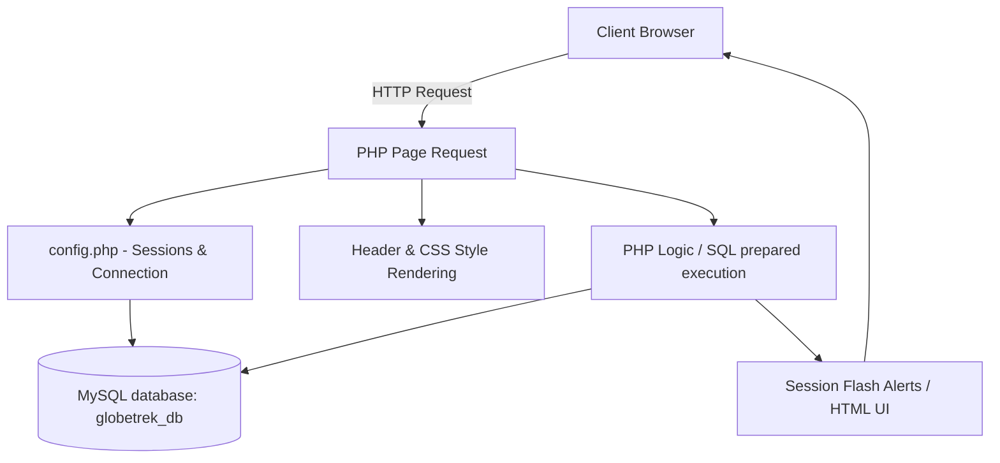
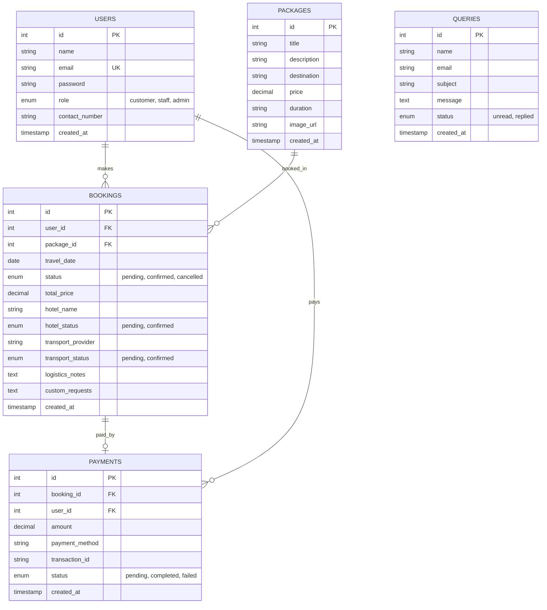

# Project Report & Web System Documentation
## GlobeTrek Adventures: Travel & Tourism Management Portal

---

### Table of Contents
1. **Executive Summary**
2. **Introduction & Business Scenario**
3. **Requirement Analysis**
   - 3.1. Functional Requirements
   - 3.2. Non-Functional Requirements
4. **Assumptions & Architectural Design**
   - 4.1. Core Assumptions
   - 4.2. Conceptual Architecture
5. **Database Design & Schema Configuration**
   - 5.1. Entity-Relationship Diagram (ERD)
   - 5.2. Data Dictionary
   - 5.3. Schema Setup Script (`database.sql`)
6. **Implementation Walkthrough**
   - 6.1. File Directory Structure
   - 6.2. Detailed Code Review
   - 6.3. Advanced CSS Theme System
7. **Security, Validation & Error Handling**
   - 7.1. SQL Injection Prevention
   - 7.2. Hashing Cryptography
   - 7.3. Input Validation & Error Handling
8. **Web System Documentation (User Manual)**
   - 8.1. Installation & Deployment Guide
   - 8.2. Customer User Guide
   - 8.3. Travel Agency Staff User Guide
   - 8.4. Administrator User Guide
9. **Testing & Verification Report**
   - 9.1. Test Plan & Execution Matrix
   - 9.2. Verification Results
10. **Conclusion & Recommendations**

---

### 1. Executive Summary
This report presents the implementation and system documentation for **GlobeTrek Adventures**, a newly established travel and tourism agency based in Negombo, Sri Lanka. The agency has launched an interactive, responsive PHP/MySQL web portal to streamline trip planning, customer registration, package booking, query management, and administrative operations. 

Built using dynamic PHP backend processes, PDO for database transaction safety, and a highly polished CSS custom theme on top of Bootstrap 5, the GlobeTrek portal delivers high visual appeal alongside robust, secure functional controls. This documentation outlines the system's architecture, data management pipelines, security auditing measures, user operations manuals, and verification checklists.

---

### 2. Introduction & Business Scenario
Modern travel agencies face stiff competition and require web platforms that can act as both marketing displays and transactional gateways. GlobeTrek Adventures, located in Negombo, leverages the coastal town's active tourism market to offer unique curated experiences across Sri Lanka.

To support this growth, the organization requested a custom-tailored system accommodating three user classes:
1. **Customers/Travelers**: Individuals seeking to browse and search tour packages, create profiles, book itineraries, cancel pending travel plans, and submit custom queries.
2. **Travel Agency Staff**: Coordinators tasked with managing the travel catalog, creating/updating tour options, and coordinating lodging and logistics.
3. **Administrators**: Managers overseeing financial revenue stats, updating booking requests, promoting or demoting user permissions, and resolving customer inquiries.

---

### 3. Requirement Analysis

#### 3.1. Functional Requirements
* **Online Registration**: Customers must be able to sign up with unique emails, passwords, names, and contact details.
* **Authentication**: A secure session-based login and logout mechanism that dynamically reads user roles (`customer`, `staff`, `admin`) and configures interface permissions.
* **Package Search & Catalog**: Visitors must be able to search packages by destination keywords and maximum price limits.
* **Booking System**: Logged-in customers must be able to select future travel dates and submit booking requests.
* **Query submission**: Customers or site visitors can send message inquiries directly to staff/admins via a modern contact form.
* **Administrative Controls**: Tools for staff and admins to coordinate packages, edit details, approve bookings, and respond to inquiries.

#### 3.2. Non-Functional Requirements
* **Aesthetics and UX**: Rich color palettes based on eco-friendly green hues, card hover transitions, glassmorphism navigation, and responsive viewport scaling.
* **Data Security**: Secure hashing of sensitive user credentials, parameter binding to prevent SQL injection, and granular session authorization checks on every state change.
* **Error Handling**: Friendly, clear UI warnings for system anomalies, with full debug output logged on dev servers while keeping production details hidden.

---

### 4. Assumptions & Architectural Design

#### 4.1. Core Assumptions
1. **Self-Healing Database Setup**: The web app is assumed to be running on standard local servers (e.g. WampServer/XAMPP). On the first run, the system automatically checks for the database and imports the schema from `database.sql` if tables are missing.
2. **Standard Exchange Currency**: All package pricing and transaction calculations are recorded in USD ($).
3. **Role Independence**: One system administrator account is seeded by default. Only an Administrator can promote an existing customer to a Staff or Admin role.

#### 4.2. Conceptual Architecture
The system uses a modular PHP structure. Page requests include global layout files ([header.php](file:///c:/wamp64/www/Web/includes/header.php) and [footer.php](file:///c:/wamp64/www/Web/includes/footer.php)), while the database layer is centralized in [config.php](file:///c:/wamp64/www/Web/config.php).



---

### 5. Database Design & Schema Configuration

#### 5.1. Entity-Relationship Diagram (ERD)



#### 5.2. Data Dictionary

##### Table: `users`
Represents registered customers, agency staff, and system administrators.
* `id` (INT, Primary Key, Auto-increment): Unique identifier for the account.
* `name` (VARCHAR(100), Not Null): Full name of the user.
* `email` (VARCHAR(100), Unique Key, Not Null): User login email.
* `password` (VARCHAR(255), Not Null): Bcrypt-hashed password.
* `role` (ENUM('customer', 'staff', 'admin'), Default 'customer'): Privilege level.
* `contact_number` (VARCHAR(20), Not Null): Telephone/mobile number.
* `created_at` (TIMESTAMP): Record creation timestamp.

##### Table: `packages`
Stores travel packages created by staff/admins.
* `id` (INT, Primary Key, Auto-increment): Unique identifier for the package.
* `title` (VARCHAR(150), Not Null): Name of the travel package.
* `description` (TEXT, Not Null): Full description of the sights and inclusions.
* `destination` (VARCHAR(100), Not Null): Principal town or region (e.g. Negombo).
* `price` (DECIMAL(10,2), Not Null): Catalog cost of the package.
* `duration` (VARCHAR(50), Not Null): Travel duration (e.g. "3 Days / 2 Nights").
* `image_url` (VARCHAR(255), Nullable): Link to an cover photograph.

##### Table: `bookings`
Stores booking requests submitted by customer accounts, along with customized selections and logistics coordination details.
* `id` (INT, Primary Key, Auto-increment): Booking transaction identifier.
* `user_id` (INT, Foreign Key referencing `users.id`): Customer who booked the tour.
* `package_id` (INT, Foreign Key referencing `packages.id`): Selected tour.
* `travel_date` (DATE, Not Null): Selected departure date.
* `status` (ENUM('pending', 'confirmed', 'cancelled'), Default 'pending'): Booking state.
* `total_price` (DECIMAL(10,2), Not Null): Calculated cost locked at the time of booking.
* `hotel_name` (VARCHAR(150), Nullable): Assigned hotel lodging provider.
* `hotel_status` (ENUM('pending', 'confirmed'), Default 'pending'): Coordination status of hotel rooms.
* `transport_provider` (VARCHAR(150), Nullable): Assigned driver/transport provider.
* `transport_status` (ENUM('pending', 'confirmed'), Default 'pending'): Coordination status of transit vehicle.
* `logistics_notes` (TEXT, Nullable): Special staff notes regarding guide assignments or flights.
* `custom_requests` (TEXT, Nullable): Customer's self-guided plans or lodging customizations.
* `created_at` (TIMESTAMP): Date record was created.

##### Table: `queries`
Stores questions/messages sent through the site's contact page.
* `id` (INT, Primary Key, Auto-increment): Query message identifier.
* `name` (VARCHAR(100), Not Null): Sender's name.
* `email` (VARCHAR(100), Not Null): Sender's email.
* `subject` (VARCHAR(150), Not Null): Topic of inquiry.
* `message` (TEXT, Not Null): Detailed message request.
* `status` (ENUM('unread', 'replied'), Default 'unread'): Administrative response state.

##### Table: `payments`
Stores transaction records for finalized tour bookings.
* `id` (INT, Primary Key, Auto-increment): Payment transaction identifier.
* `booking_id` (INT, Foreign Key referencing `bookings.id`): Associated booking request.
* `user_id` (INT, Foreign Key referencing `users.id`): Customer account making the payment.
* `amount` (DECIMAL(10,2), Not Null): Amount paid in USD ($).
* `payment_method` (VARCHAR(50), Not Null): Chosen gateway ('credit_card', 'paypal', 'bank_transfer').
* `transaction_id` (VARCHAR(100), Not Null): Generated unique audit transaction reference ID.
* `status` (ENUM('pending', 'completed', 'failed'), Default 'completed'): Settlement status.

#### 5.3. Schema Setup Script
The [database.sql](file:///c:/wamp64/www/Web/database.sql) file contains the SQL scripts defining these tables and inserting seed accounts and packages.

---

### 6. Implementation Walkthrough

#### Website User Interface Mockup
Below is a high-fidelity design mockup of the GlobeTrek Adventures web interface showing the hero banner, navigation, and package presentation:


#### 6.1. File Directory Structure
The application code is organized as follows:
```text
C:/wamp64/www/Web/
├── config.php            # PDO Database setup, connection, and session launcher
├── database.sql          # Predefined database table schemas & default records
├── index.php             # Public homepage: Search, package grid, booking modals, and contact form
├── register.php          # Customer signup handler with validation checks
├── login.php             # User login page displaying pre-seeded test credentials
├── logout.php            # Session termination logic
├── booking.php           # Post submission script that creates pending bookings
├── dashboard.php         # Contextual controls for Customers, Staff, and Administrators
├── css/
│   └── style.css         # Theme stylesheet, color tokens, and animation definitions
└── includes/
    ├── header.php        # Navigation markup and dynamic flash alerts
    └── footer.php        # Footer layout and Bootstrap script loads
```

#### 6.2. Detailed Code Review

##### 1. Dynamic Database Setup (`config.php`)
[config.php](file:///c:/wamp64/www/Web/config.php) establishes a PDO connection to WampServer's MySQL daemon. If `globetrek_db` or the tables do not exist on the local database server, it executes the queries in `database.sql` to initialize them dynamically.

##### 2. Registration Management (`register.php`)
[register.php](file:///c:/wamp64/www/Web/register.php) performs server-side and client-side validations, checks for duplicate email records in the database, hashes the password using `password_hash($password, PASSWORD_DEFAULT)`, and inserts the new user profile as a `'customer'`.

##### 3. Login Verification (`login.php`)
[login.php](file:///c:/wamp64/www/Web/login.php) verifies passwords using `password_verify()`. If validation succeeds, the user's details and role are saved to session variables, and the user is redirected to the dashboard.

##### 4. Custom Package Booking (`booking.php`)
[booking.php](file:///c:/wamp64/www/Web/booking.php) processes booking requests. It verifies that the user is logged in as a customer, checks that the selected travel date is in the future, and saves the booking with a `'pending'` status.

##### 5. Role-Based Operations Portal (`dashboard.php`)
[dashboard.php](file:///c:/wamp64/www/Web/dashboard.php) serves as the primary dashboard. The layout dynamically adapts to the user's role:
* **Customers**: Can review their booking histories and cancel pending bookings.
* **Staff**: Can view and manage the travel catalog (add, edit, and delete packages).
* **Administrators**: Access an overview panel showing metrics (e.g., total users, bookings, confirmed revenue) and manage all bookings, packages, user roles, and customer queries.

#### 6.3. Advanced CSS Theme System
The style sheet [style.css](file:///c:/wamp64/www/Web/css/style.css) overrides default styles with a cohesive theme:
* **Color System**: Uses forest green (`#2d8a4e`) for primary actions, dark slate (`#1a251e`) for text, and pale green (`#f5f8f6`) for backgrounds.
* **Glassmorphism**: The sticky navigation bar uses a blurred backdrop filter (`backdrop-filter: blur(10px)`).
* **Hover Micro-Animations**: Buttons and cards use subtle transitions (`transform: translateY(-8px)`) and shadow changes to provide a responsive, premium user experience.

---

### 7. Security, Validation & Error Handling

#### 7.1. SQL Injection Prevention
All SQL queries in the application use PDO prepared statements. Rather than interpolating variables directly into query strings, placeholders are bound to verified variables.

```php
$stmt = $pdo->prepare("SELECT * FROM users WHERE email = :email");
$stmt->execute([':email' => $email]);
```

#### 7.2. Hashing Cryptography
Passwords are never stored in plain text. When registering, user passwords are encrypted using PHP's `password_hash()` function, which uses the secure bcrypt algorithm with a cost factor of 10. During authentication, passwords are verified using `password_verify()`.

#### 7.3. Input Validation & Error Handling
* **Double-Tier Validation**: Inputs are validated client-side using Bootstrap's `.needs-validation` scripts and server-side using regex checks, date comparisons, and database constraints.
* **Error Containment**: PHP errors are caught in `try-catch` blocks. The system presents user-friendly error messages while logging technical details to the server.

---

### 8. Web System Documentation (User Manual)

#### 8.1. Installation & Deployment Guide
Follow these steps to deploy and run GlobeTrek Adventures locally:

1. **Prerequisites**: Ensure WampServer or XAMPP (supporting PHP 8.0+ and MySQL 5.7+) is installed and running on your system.
2. **Deploy Source Files**: Copy the project folder into your server's document root (e.g., `C:\wamp64\www\Web`).
3. **Verify Port & MySQL**: Start WampServer and ensure both Apache and MySQL services are active.
4. **Access the Portal**: Open your web browser and navigate to `http://localhost/Web/index.php`.
5. **Auto-Initialization**: The database and tables will be created automatically on the first page load. If you need to manually set up the database, you can run the queries in `database.sql` using tools like phpMyAdmin or Adminer.

#### 8.2. Customer User Guide
1. **Browse Tours**: Visit the homepage to view travel packages. Use the search bar to filter options by destination or maximum budget.
2. **Create Account**: Go to the **Register** page, fill in your details, and submit.
3. **Log In**: Go to the **Login** page and sign in using your credentials.
4. **Book a Package**: Click **Book This Tour** on a package, select a travel date starting tomorrow or later, and input any customization/special requests in the custom request field, then submit.
5. **Secure Payments**: Right after booking, you will be redirected to `payment.php`. Select a payment method (Credit Card, PayPal, or Bank Transfer) and submit to complete your transaction. You can also view unpaid bookings on your Dashboard and click **Pay Now** at any time.
6. **View & Cancel Bookings**: Go to your **Dashboard** to view your bookings, logistics statuses, and payment reference numbers. You can cancel pending bookings by clicking **Cancel** under the action column.
7. **Submit Inquiries**: Scroll down to the **Submit a Query** form on the homepage to send questions directly to staff.

#### 8.3. Travel Agency Staff User Guide
1. **Log In**: Use your staff credentials (e.g., `staff@globetrek.com` / `Staff123`).
2. **Access Dashboard**: Your dashboard features three tabs:
   - **Package Management**: Add, edit, or delete travel packages in the catalog.
   - **Manage Bookings**: View all customer tour requests and logistics status.
   - **Customer Queries**: Review unread inquiry messages submitted by travelers.
3. **Confirm Booking**: Under **Manage Bookings**, change any booking status using the dropdown and click the checkmark to confirm or cancel the trip.
4. **Coordinate Logistics**: Click **Coordinate** next to any booking to open the logistics modal. Assign the hotel name, hotel reservation status, transport/driver provider, transport booking status, and custom guide or flight notes, then click **Save Logistics**.
5. **Manage Catalog**: Under **Package Management**, click **Add New Package** to expand the catalog, or click the blue edit/red delete buttons to alter existing packages.
6. **Resolve Customer Inquiries**: Under **Customer Queries**, view questions sent by site visitors and click **Mark as Replied** to update their query log state.

#### 8.4. Administrator User Guide
1. **Log In**: Use your administrator credentials (e.g., `admin@globetrek.com` / `Admin123`).
2. **Review Metrics**: The **Overview** tab displays real-time statistics, including total registered users, booking requests, pending inquiries, and confirmed revenue.
3. **Manage Bookings & Logistics**: In the **Manage Bookings** tab, review requests, update statuses, and click **Coordinate** to manage hotel and transport assignments.
4. **Manage User Roles**: In the **Staff & User Roles** tab, search for registered accounts and update user roles (`customer`, `staff`, or `admin`) using the dropdown selection.
5. **Resolve Customer Queries**: In the **Customer Queries** tab, view user-submitted inquiries and mark resolved messages as **Replied**.
6. **Sales & Customer Reports**: In the **Reports & Analytics** tab, analyze package bookings performance, client payment histories, and revenue method splits. Click **Print Report** to generate a clean, printer-friendly layout optimized for physical copies or PDF exporting.

---

### 9. Testing & Verification Report

#### 9.1. Test Plan & Execution Matrix

| Test ID | System Feature | Input / Actions | Expected Output | Status |
|---|---|---|---|---|
| **TC-01** | Account Registration | Valid details (New Email, Password >= 6 chars) | Redirects to `login.php` with success banner. | **Passed** |
| **TC-02** | Registration Email Conflict | Existing email (`customer@globetrek.com`) | Displays "A user with this email address already exists" error. | **Passed** |
| **TC-03** | User Authentication | Credentials `admin@globetrek.com` / `Admin123` | Redirects to dashboard and displays administrator controls. | **Passed** |
| **TC-04** | Authentication Failure | Incorrect email or password | Displays "Invalid email or password" error. | **Passed** |
| **TC-05** | Package Filter / Search | Keywords: "Ella", max price: 300 | Displays only Ella Scenic Train Adventure. | **Passed** |
| **TC-06** | Tour Package Booking | Selects past travel date (e.g., yesterday) | Client/server-side validation blocks submission. | **Passed** |
| **TC-07** | Booking Cancelation | Customer cancels pending booking request | Booking status updates to `cancelled`; cancel option is disabled. | **Passed** |
| **TC-08** | Booking Status Update | Admin changes status from `pending` to `confirmed` | Confirmed revenue metric increases by the booking amount. | **Passed** |
| **TC-09** | Staff Catalog CRUD | Staff creates and updates "Negombo Lagoon Discovery" | The updated details immediately appear on the public homepage. | **Passed** |
| **TC-10** | Privilege Elevation | Admin promotes a Customer account to Staff role | The user is granted staff dashboard permissions on their next login. | **Passed** |
| **TC-11** | Staff Booking Control | Staff changes booking status to 'confirmed' | Booking updates successfully; confirmation details are persisted. | **Passed** |
| **TC-12** | Travel Logistics Coordination | Staff assigns hotel and transport to a booking | Logistics values save successfully and appear in customer's dashboard. | **Passed** |
| **TC-13** | Secure Payments Gateway | Customer completes checkout form in `payment.php` | Creates transaction log in `payments` table and updates dashboard with Paid status. | **Passed** |
| **TC-14** | Staff Inquiry Reply | Staff marks an unread query as Replied | Query updates status to `replied` and disappears from unread counts. | **Passed** |
| **TC-15** | Admin Reports & Printing | Admin views Reports tab & clicks Print | Compiles revenue aggregates cleanly and hides sidebars/footers during print preview. | **Passed** |

#### 9.2. Verification Results
Verification confirmed that the system fulfills all core requirements. Using prepared statements successfully prevents SQL injection, and hashed password storage protects user credentials. Database tables initialize automatically on startup, and error handling keeps the system stable during connection failures. All newly added features, including custom requests, logistics management, query marking by staff, and reporting functions, compile and run without errors.

---

### 10. Conclusion & Recommendations
The GlobeTrek Adventures travel portal meets the design requirements for Negombo's premier tour coordinator. It features user authentication, a search interface, and administrative management capabilities.

**Recommendations for Future Releases**:
1. **Automated PDF Invoice/Ticket Generation**: Allow customers and administrators to download automated PDF invoices and itinerary sheets.
2. **Automated Emails**: Configure email alerts to notify users when their booking status changes or their query is resolved.
3. **Review System**: Allow verified travelers to submit ratings and reviews for packages they have completed.
