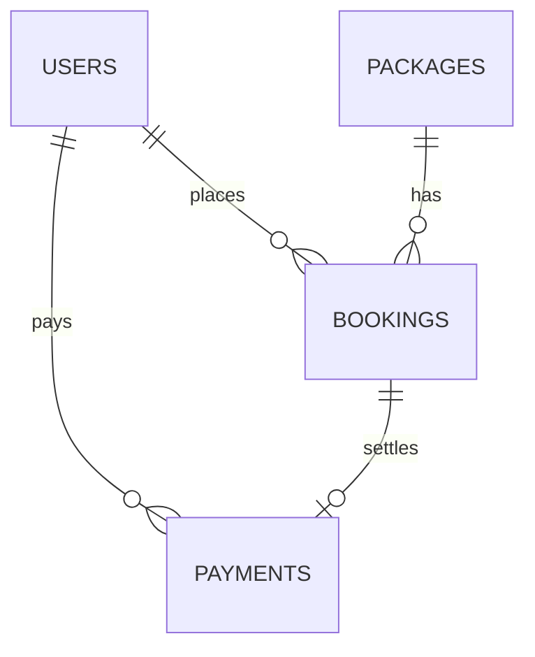

# GlobeTrek Adventures - Viva Session Preparation Guide

This guide is designed to help you explain your website's codebase, architecture, database layout, and security measures during your viva session. 

---

## 1. System Architecture & Modular Design

### Architecture Overview
The website is built using a **Modular Procedural/MVC-hybrid PHP architecture**. Instead of writing code in huge monolithic files (which are hard to maintain and read), the codebase separates database configuration, page headers, footers, action handling, and user interface panels into discrete, dedicated files.

### Key Directory Layout
- **[config.php](file:///c:/wamp64/www/Web/config.php)**: The central configurations file. Initiates secure sessions, establishes the PDO database connection, creates the database if it doesn't exist, and runs database migration scripts.
- **[dashboard.php](file:///c:/wamp64/www/Web/dashboard.php)**: The main dashboard router page. Identifies the user's role and imports the correct sidebar and tab-panel component view.
- **[packages.php](file:///c:/wamp64/www/Web/packages.php)**: Dedicated packages catalog page where clients can search, filter, and request bookings.
- [book.php](file:///c:/wamp64/www/Web/book.php): Standalone booking page for customers to submit a booking for a specific package.
- [add_package.php](file:///c:/wamp64/www/Web/add_package.php): Standalone page for staff/admin to add new packages.
- [edit_package.php](file:///c:/wamp64/www/Web/edit_package.php): Standalone page for staff/admin to edit existing packages.
- **`includes/`**:
  - **[header.php](file:///c:/wamp64/www/Web/includes/header.php)**: Displays metadata, standard CSS imports, navigation bar with login/logout states, and flash notifications.
  - **[footer.php](file:///c:/wamp64/www/Web/includes/footer.php)**: Renders the site footer links and initiates Bootstrap JS.
  - **`dashboard/`** *(New component folder)*:
    - **[actions.php](file:///c:/wamp64/www/Web/includes/dashboard/actions.php)**: Central controller for processing all dashboard requests (GET/POST) before page load.
    - **[customer_bookings.php](file:///c:/wamp64/www/Web/includes/dashboard/customer_bookings.php)**: Customer panel showing active tours, payment triggers, and booking status.
    - **[admin_overview.php](file:///c:/wamp64/www/Web/includes/dashboard/admin_overview.php)**: Statistics overview card deck.
    - **[manage_bookings.php](file:///c:/wamp64/www/Web/includes/dashboard/manage_bookings.php)**: Shared staff/admin panel to confirm/cancel bookings.
    - **[manage_packages.php](file:///c:/wamp64/www/Web/includes/dashboard/manage_packages.php)**: Shared staff/admin catalog CRUD (add, edit, delete tours).
    - **[manage_users.php](file:///c:/wamp64/www/Web/includes/dashboard/manage_users.php)**: Admin panel to update user account roles.
    - **[manage_queries.php](file:///c:/wamp64/www/Web/includes/dashboard/manage_queries.php)**: Shared panel to view and reply to customer inquiries.
    - **[reports.php](file:///c:/wamp64/www/Web/includes/dashboard/reports.php)**: Admin sales reports and print analytics.

---

## 2. Database Schema and Relationships

The system uses a relational MySQL database (`globetrek_db`) with 5 linked tables:



### Table Specifications
1. **`users`**: Stores client, staff, and admin accounts.
   - `id` (INT, Primary Key)
   - `name` (VARCHAR)
   - `email` (VARCHAR, Unique)
   - `password` (VARCHAR, hashed for security)
   - `contact_number` (VARCHAR)
   - `role` (ENUM: `customer`, `staff`, `admin`)
2. **`packages`**: Stores tour agency travel packages.
   - `id` (INT, Primary Key)
   - `title`, `description`, `destination`, `duration`, `image_url`
   - `price` (DECIMAL)
3. **`bookings`**: Connects users to packages and logs tour arrangements.
    - `id` (INT, Primary Key)
    - `user_id` (INT, Foreign Key referencing `users(id)`)
    - `package_id` (INT, Foreign Key referencing `packages(id)`)
    - `arrival_date` (DATE, arrival date)
    - `departure_date` (DATE, departure date)
    - `num_adults` (INT, number of adult guests)
    - `num_children_older` (INT, number of children aged 06-11 years)
    - `num_children_younger` (INT, number of children below 05 years)
    - `num_rooms` (INT, number of hotel/guesthouse rooms requested)
    - `accommodation_preference` (VARCHAR, selected accommodation style)
    - `special_requests` (TEXT, special guest requests/customizations)
    - `contact_name` (VARCHAR, traveler primary contact name)
    - `contact_email` (VARCHAR, traveler contact email address)
    - `contact_phone` (VARCHAR, traveler phone or WhatsApp)
    - `contact_country` (VARCHAR, traveler home country)
    - `status` (ENUM: `pending`, `confirmed`, `cancelled`)
    - `total_price` (DECIMAL, dynamically calculated: `base_price * (num_adults + 0.5 * num_children_older)`)
4. **`payments`**: Logs completed transactions.
   - `id` (INT, Primary Key)
   - `booking_id` (INT, Foreign Key referencing `bookings(id)`)
   - `user_id` (INT, Foreign Key referencing `users(id)`)
   - `amount` (DECIMAL), `payment_method`, `transaction_id`, `status`
5. **`queries`**: Stores feedback submissions from the Contact Form.
   - `id` (INT, Primary Key)
   - `name`, `email`, `subject`, `message`, `status` (`unread`, `replied`)

---

## 3. Key Technical Concepts (Examiner Favorites)

### A. How is Database Security Implemented?
Examiners will ask: *"How do you prevent SQL injection?"*
- **Answer**: By using **PDO (PHP Data Objects) with Prepared Statements**.
- **Explanation**: In files like `actions.php`, variables are never concatenated directly into SQL strings. Instead, named placeholders (e.g. `:user_id`, `:booking_id`) are used, and the values are bound at execution time. The database processes the SQL query structure and the variable data separately, making it impossible for malicious SQL code to alter the query logic.
- **Example from Code**:
  ```php
  $stmt = $pdo->prepare("UPDATE bookings SET status = :status WHERE id = :id");
  $stmt->execute([':status' => $status, ':id' => $booking_id]);
  ```

### B. Session Management and Role Authorization
Examiners will ask: *"How do you know who is logged in and what they can view?"*
- **Answer**: PHP Session Variables coupled with Role Authorization checks.
- **Explanation**:
  1. Once credentials match during login, the system writes `$user_id`, `$user_name`, and `$user_role` to the superglobal `$_SESSION`.
  2. In `actions.php` and `dashboard.php`, we check if `$_SESSION['user_id']` is set. If not, the user is redirected to `login.php`.
  3. Action authorizations are strictly role-gated. For example, changing user roles is hard-coded to check `$user_role === 'admin'`:
     ```php
     if ($user_role === 'admin' && $action === 'change_role') { ... }
     ```

### C. Preventing XSS (Cross-Site Scripting) Attacks
Examiners will ask: *"How do you prevent users from injecting malicious script tags into input fields?"*
- **Answer**: Using **HTML Entity Encoding**.
- **Explanation**: Before displaying database string records in HTML, the code wraps parameters inside the `htmlspecialchars()` utility. This converts HTML characters like `<` and `>` into safe code representations (`&lt;` and `&gt;`), rendering them as static text instead of executable script tags.
- **Example from Code**:
  ```php
  <strong><?php echo htmlspecialchars($bk['user_name']); ?></strong>
  ```

### D. Advanced SQL Queries (Aggregates & Joins)
Examiners will ask: *"Explain one of your complex SQL queries."*
- **Answer**: Point them to the Analytics Reports code in `reports.php`.
- **Explanation**: The Package Sales Performance report joins `packages` with `bookings` using a `LEFT JOIN` (to include packages even if they have 0 bookings). It uses aggregate functions like `COUNT` and `SUM` to compile metrics:
  ```sql
  SELECT p.id, p.title, p.destination, p.price,
         COUNT(b.id) AS bookings_count,
         SUM(CASE WHEN b.status = 'confirmed' THEN 1 ELSE 0 END) AS confirmed_count,
         COALESCE(SUM(CASE WHEN b.status = 'confirmed' THEN b.total_price ELSE 0 END), 0) AS confirmed_revenue
  FROM packages p
  LEFT JOIN bookings b ON p.id = b.package_id
  GROUP BY p.id, p.title, p.destination, p.price
  ORDER BY confirmed_revenue DESC;
  ```
  - `COUNT(b.id)` gets the total booking count per package.
  - `SUM(CASE WHEN b.status = 'confirmed' THEN b.total_price ELSE 0 END)` calculates the revenue for *only* confirmed bookings.
  - `COALESCE(..., 0)` replaces null values with 0.

### E. Booking, Payment, and Admin Approval Flow
Examiners will ask: *"How does the booking, payment, and approval flow work?"*
- **Answer**: 
  1. **LKR Localization**: All pricing represents and keeps prices in Sri Lankan Rupees (Rs) for local Negombo tourist operations.
  2. **Client-side Feedback**: When the user changes guest demographic numbers on [book.php](file:///c:/wamp64/www/Web/book.php), a JavaScript event listener reads the base price and updates the estimated total in Rs: `basePrice * (adults + 0.5 * children_older)`.
  3. **Direct Redirect to Payment**: Upon booking submission, the booking is created with status `pending`. The customer is redirected directly to the payment page (`payment.php`) to complete the payment immediately.
  4. **Dashboard Gating**: 
     - While the booking is `pending` and unpaid, the status displays as **Awaiting Payment**, and the **Pay Now** button is active.
     - Once payment is completed, the status updates to **Awaiting Approval** and the **Pay Now** button is hidden, showing **Paid**. The **Cancel** action is disabled to prevent canceling paid bookings.
  5. **Admin/Staff Approval**: An admin/staff reviews the paid booking in the dashboard and changes the booking status to `confirmed` to approve it.
  6. **Server-side Security**: PHP backend validates that payments are only made for valid, active (non-cancelled) bookings and restricts client cancellation to unpaid pending bookings.

### F. File Upload Security (Choosing Image from PC vs URL)
Examiners will ask: *"How do you handle local file uploads securely?"*
- **Answer**: By strictly validating file extensions, checking file sizes, generating unique filenames, and storing uploads in a non-executable directory.
- **Explanation**:
  1. **Dual Image Input**: In `add_package.php` and `edit_package.php`, staff/admins can either specify a remote web image URL or upload an image file from their PC (using `enctype="multipart/form-data"`).
  2. **Security Controls**:
     - **File extension check**: The PHP code verifies the file extension against a whitelist of safe image formats (`jpg`, `jpeg`, `png`, `gif`, `webp`) to prevent malicious executable scripts (e.g. `.php` files) from being uploaded.
     - **Size limit check**: It limits the file size to 5MB to prevent storage exhaustion.
     - **Name sanitization**: It generates a unique random filename using `uniqid('pkg_', true)` before saving it in the `uploads/` folder. This prevents filename collisions and directory traversal attacks.

---

## 4. Quick-Fire Viva Questions & Answers

1. **Q: Why did you choose PDO over MySQLi?**
   - **A**: PDO is database-independent, meaning we can switch from MySQL to PostgreSQL or SQLite without rewriting our core query functions. It also supports named parameters, which makes code more readable than positional parameters.

2. **Q: What is a flash message? How does it display after redirection?**
   - **A**: A flash message is a temporary notification. We save the message in `$_SESSION['flash_success']` or `$_SESSION['flash_error']` in `actions.php` and perform a header redirect. When the next page loads, `header.php` checks if the session variable is set, displays the alert banner, and immediately deletes (`unset()`) the session variable so it does not appear again on subsequent refreshes.

3. **Q: Why do we hash passwords? What algorithm was used?**
   - **A**: Passwords must never be stored in plain text to protect user privacy in case of a database breach. We hash passwords during registration using PHP's `password_hash()` which uses the **bcrypt** algorithm by default. Passwords are safe because bcrypt is a slow, computation-intensive hashing algorithm, rendering brute-force attacks infeasible.
